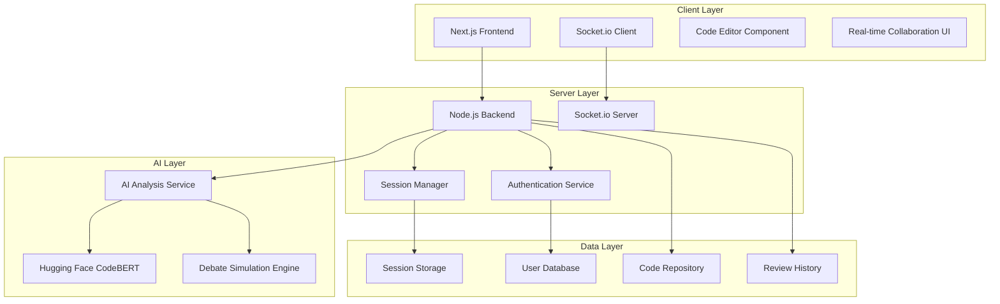

# Design Document

## Overview

The Collaborative Code Review Simulator with AI Feedback is a full-stack web application that combines real-time collaboration capabilities with AI-powered code analysis. The system architecture follows a client-server model with WebSocket connections for real-time communication and integrates with Hugging Face's CodeBERT for intelligent code analysis and debate simulation.

## Architecture

### High-Level Architecture



### Technology Stack

- **Frontend**: Next.js 14+ with TypeScript, React 18+
- **Backend**: Node.js with Express.js
- **Real-time Communication**: Socket.io
- **AI Integration**: Hugging Face Transformers API (CodeBERT)
- **Database**: PostgreSQL for persistent data, Redis for session management
- **Authentication**: JWT with refresh tokens
- **File Storage**: Local filesystem with configurable cloud storage support

## Components and Interfaces

### Frontend Components

#### CodeReviewInterface
```typescript
interface CodeReviewInterface {
  sessionId: string;
  codeContent: string;
  annotations: Annotation[];
  participants: User[];
  aiSuggestions: AISuggestion[];
  debateMode: boolean;
}
```

#### Real-time Collaboration Manager
```typescript
interface CollaborationManager {
  joinSession(sessionId: string): Promise<void>;
  addAnnotation(annotation: Annotation): void;
  highlightCode(range: CodeRange): void;
  sendTypingIndicator(isTyping: boolean): void;
  subscribeToUpdates(callback: (update: CollaborationUpdate) => void): void;
}
```

### Backend Services

#### Session Management Service
```typescript
interface SessionService {
  createSession(userId: string, codeSnippet: CodeSnippet): Promise<Session>;
  joinSession(sessionId: string, userId: string): Promise<void>;
  leaveSession(sessionId: string, userId: string): Promise<void>;
  getSessionState(sessionId: string): Promise<SessionState>;
  updateSessionState(sessionId: string, update: SessionUpdate): Promise<void>;
}
```

#### AI Analysis Service
```typescript
interface AIAnalysisService {
  analyzeCode(codeSnippet: CodeSnippet): Promise<AnalysisResult>;
  generateSuggestions(analysis: AnalysisResult): Promise<AISuggestion[]>;
  simulateDebate(codeChange: CodeChange): Promise<DebateArguments>;
  continueDebate(context: DebateContext, userInput: string): Promise<DebateResponse>;
}
```

### WebSocket Event Schema

#### Client to Server Events
```typescript
interface ClientEvents {
  'join-session': { sessionId: string; userId: string };
  'add-annotation': { sessionId: string; annotation: Annotation };
  'highlight-code': { sessionId: string; range: CodeRange };
  'typing-indicator': { sessionId: string; isTyping: boolean };
  'request-ai-analysis': { sessionId: string; codeSnippet: CodeSnippet };
  'activate-debate-mode': { sessionId: string; codeChange: CodeChange };
  'debate-response': { sessionId: string; response: string };
}
```

#### Server to Client Events
```typescript
interface ServerEvents {
  'session-joined': { participants: User[]; sessionState: SessionState };
  'annotation-added': { annotation: Annotation; userId: string };
  'code-highlighted': { range: CodeRange; userId: string };
  'typing-indicator': { userId: string; isTyping: boolean };
  'ai-analysis-complete': { suggestions: AISuggestion[] };
  'debate-arguments': { arguments: DebateArguments };
  'debate-response': { response: DebateResponse };
  'error': { message: string; code: string };
}
```

## Data Models

### Core Data Models

#### User Model
```typescript
interface User {
  id: string;
  username: string;
  email: string;
  avatar?: string;
  createdAt: Date;
  lastActive: Date;
}
```

#### Session Model
```typescript
interface Session {
  id: string;
  creatorId: string;
  codeSnippet: CodeSnippet;
  participants: string[]; // User IDs
  annotations: Annotation[];
  aiSuggestions: AISuggestion[];
  debateHistory: DebateEntry[];
  status: 'active' | 'paused' | 'completed';
  createdAt: Date;
  updatedAt: Date;
}
```

#### CodeSnippet Model
```typescript
interface CodeSnippet {
  id: string;
  content: string;
  language: string;
  filename?: string;
  size: number;
  uploadedAt: Date;
}
```

#### Annotation Model
```typescript
interface Annotation {
  id: string;
  userId: string;
  sessionId: string;
  lineStart: number;
  lineEnd: number;
  columnStart: number;
  columnEnd: number;
  content: string;
  type: 'comment' | 'suggestion' | 'question';
  createdAt: Date;
}
```

#### AISuggestion Model
```typescript
interface AISuggestion {
  id: string;
  sessionId: string;
  type: 'bug' | 'optimization' | 'style';
  severity: 'low' | 'medium' | 'high';
  lineStart: number;
  lineEnd: number;
  title: string;
  description: string;
  suggestedFix?: string;
  confidence: number; // 0-1
  createdAt: Date;
}
```

#### DebateEntry Model
```typescript
interface DebateEntry {
  id: string;
  sessionId: string;
  type: 'ai-argument' | 'ai-counter' | 'user-response';
  content: string;
  relatedCodeChange: CodeChange;
  timestamp: Date;
}
```

### Database Schema Design

#### PostgreSQL Tables
- `users` - User account information
- `sessions` - Review session metadata
- `code_snippets` - Uploaded code content
- `annotations` - User comments and annotations
- `ai_suggestions` - AI-generated recommendations
- `debate_entries` - Debate conversation history
- `session_participants` - Many-to-many relationship table

#### Redis Schema
- `session:{sessionId}:state` - Current session state
- `session:{sessionId}:participants` - Active participants set
- `user:{userId}:sessions` - User's active sessions
- `typing:{sessionId}` - Typing indicators hash

## Error Handling

### Client-Side Error Handling
- Network connectivity issues with automatic reconnection
- WebSocket connection failures with fallback mechanisms
- File upload validation and size limit enforcement
- User input validation with real-time feedback

### Server-Side Error Handling
- AI service unavailability with graceful degradation
- Database connection failures with retry logic
- Session capacity limits with queue management
- Authentication failures with clear error messages

### AI Integration Error Handling
- CodeBERT API rate limiting with request queuing
- Model inference failures with fallback responses
- Unsupported programming languages with user notification
- Debate generation failures with standard review mode fallback

## Testing Strategy

### Unit Testing
- **Frontend**: Jest + React Testing Library for component testing
- **Backend**: Jest + Supertest for API endpoint testing
- **AI Service**: Mock Hugging Face API responses for consistent testing
- **Database**: In-memory database for isolated unit tests

### Integration Testing
- **WebSocket Communication**: Test real-time event flow between client and server
- **AI Integration**: Test CodeBERT integration with sample code snippets
- **Database Operations**: Test CRUD operations and data consistency
- **Authentication Flow**: Test JWT token generation and validation

### End-to-End Testing
- **User Workflows**: Playwright tests for complete user journeys
- **Multi-user Scenarios**: Test concurrent user interactions
- **AI Feedback Loop**: Test complete code upload to AI suggestion workflow
- **Debate Mode**: Test AI debate generation and user interaction flow

### Performance Testing
- **Concurrent Sessions**: Load testing with multiple simultaneous sessions
- **WebSocket Scalability**: Test connection limits and message throughput
- **AI Response Times**: Benchmark CodeBERT analysis performance
- **Database Performance**: Query optimization and connection pooling tests

### Security Testing
- **Authentication**: Test JWT security and session management
- **Input Validation**: Test code injection and XSS prevention
- **File Upload Security**: Test malicious file upload prevention
- **Rate Limiting**: Test API abuse prevention mechanisms

## Deployment and Scalability Considerations

### Horizontal Scaling
- Load balancer configuration for multiple Node.js instances
- Redis cluster for session state management
- Database read replicas for improved performance
- CDN integration for static asset delivery

### Monitoring and Observability
- Application performance monitoring (APM)
- Real-time error tracking and alerting
- WebSocket connection monitoring
- AI service usage and performance metrics

### Security Measures
- HTTPS enforcement with SSL/TLS certificates
- CORS configuration for cross-origin requests
- Rate limiting for API endpoints and WebSocket connections
- Input sanitization and validation at all entry points